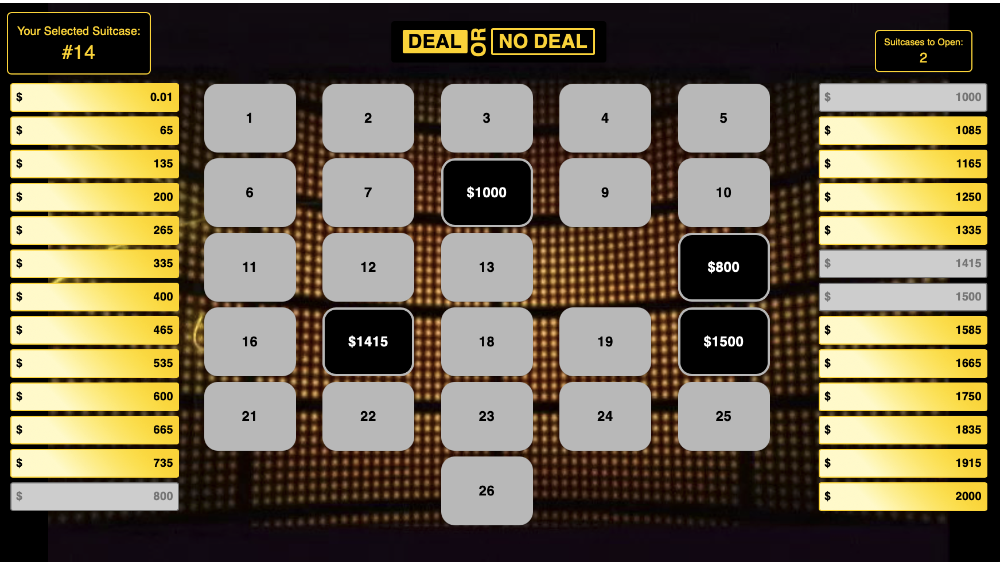

# Deal or No Deal Game

This is a web-based implementation of the popular game show "Deal or No Deal". The game allows users to select suitcases and receive offers from the banker, with the goal of winning the highest amount of money possible.



## Features

- Select a top prize value to start the game.
- Option to use "Big Money" mode for different prize distributions.
- Randomly generated suitcase values based on the selected top prize.
- Interactive UI to select and open suitcases.
- Banker offers based on the remaining suitcase values.
- Win dialog to show the final amount won.

## Installation

1. Clone the repository:
   ```bash
   git clone https://github.com/yourusername/GameShow.git
   cd GameShow
   ```

2. Install dependencies:
   ```bash
   npm install
   ```

3. Start the development server:
   ```bash
   npm run dev
   ```

4. Open your browser and navigate to `http://localhost:3000` to play the game.

## How to Play

1. **Enter Top Prize**: When you start the game, you will be prompted to enter the top prize value. This value will be the highest amount you can win.

2. **Use Big Money**: You can choose to enable "Big Money" mode by checking the checkbox. This mode changes the distribution of the suitcase values.

3. **Select Your Suitcase**: Click on any suitcase to select it as your own. This suitcase will be set aside and opened at the end of the game.

4. **Open Suitcases**: Open the remaining suitcases one by one. The number of suitcases you need to open per round is displayed on the screen.

5. **Banker Offer**: After each round, the banker will make an offer based on the remaining suitcase values. You can choose to accept the deal or continue playing.

6. **Win Amount**: If you accept the deal, the game will show a dialog with the amount you won. If you continue playing, the game will proceed until all suitcases are opened.

7. **Final Suitcase**: If you reach the end without accepting a deal, the final suitcase will be opened to reveal your prize.

## Components

- **App.jsx**: Main component that handles the game logic and UI.
- **BankerOffer.jsx**: Component that displays the banker's offer and handles deal/no deal actions.
- **Suitcase.jsx**: Component that represents a suitcase and handles click events.
- **SuitcaseCount.jsx**: Component that displays the number of suitcases to open in the current round.
- **Logo.jsx**: Component that displays the game logo.


## Customization

You can customize the game by modifying the components and styles in the `src` directory. The suitcase values, banker offer calculations, and UI elements can be adjusted to fit your preferences.

## License

This project is licensed under the MIT License. See the [LICENSE](LICENSE) file for details.

## Acknowledgements

- Inspired by the "Deal or No Deal" game show.
- Built with React and Material-UI.

Enjoy the game!
